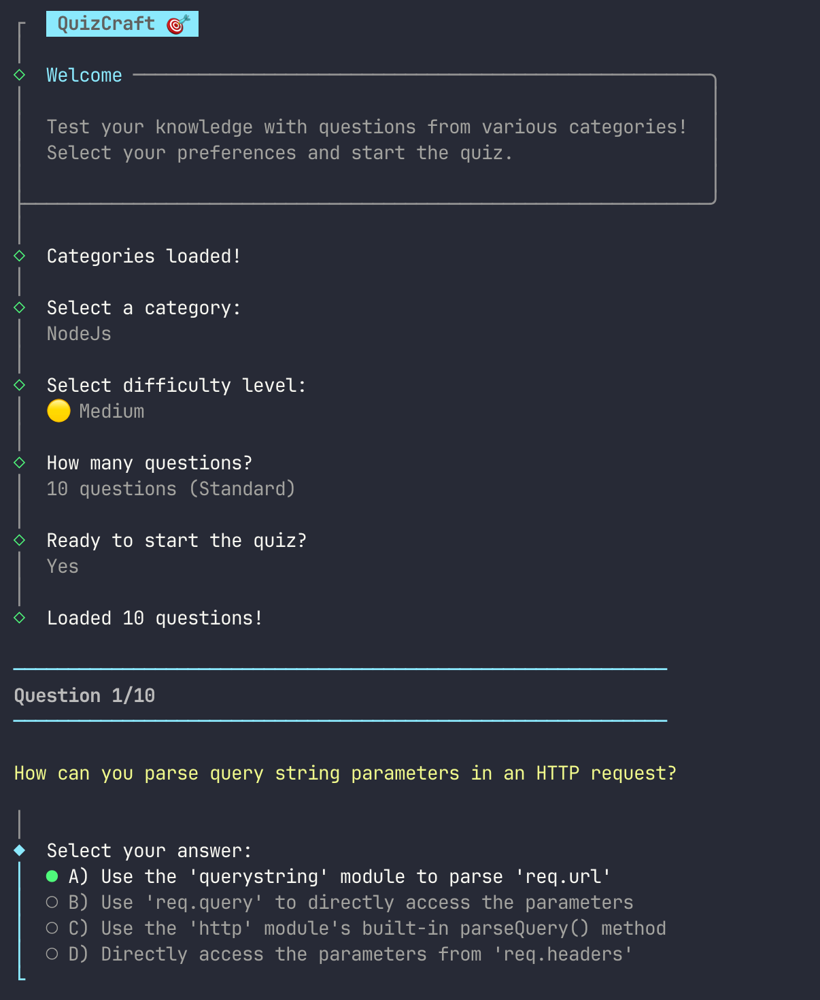

# QuizCraft 🎯

A beautiful Terminal User Interface (TUI) quiz application that fetches questions from [quizapi.io](https://quizapi.io) and provides an interactive quiz experience.



## Features

- 🎨 Beautiful, colorful terminal interface
- 📚 Multiple categories to choose from
- 🎚️ Three difficulty levels (Easy, Medium, Hard)
- 📊 Real-time score tracking
- 💡 Answer explanations
- 🔄 Play again option
- ⚡ Fast and responsive

## Prerequisites

- Node.js v18 or higher
- An API key from [quizapi.io](https://quizapi.io) (free tier available)

## Installation

1. Clone the repository:
```bash
git clone <repository-url>
cd try-copilot
```

2. Install dependencies:
```bash
npm install
```

3. Set up your API key:
   - Copy `.env.example` to `.env`
   - Get your API key from [https://quizapi.io/clientarea/settings/token](https://quizapi.io/clientarea/settings/token)
   - Add your API key to `.env`:
   ```
   QUIZ_API_KEY=your_actual_api_key_here
   ```

## Usage

Run the quiz application:

```bash
npm start
```

Or if you want to use it as a global command:

```bash
npm link
quizcraft
```

## How It Works

1. **Start the application** - QuizCraft welcomes you and fetches available categories
2. **Select a category** - Choose from various topics like Linux, DevOps, Programming, or select "All Categories"
3. **Choose difficulty** - Pick Easy 🟢, Medium 🟡, Hard 🔴, or Mixed
4. **Select question count** - Choose between 5, 10, 15, or 20 questions
5. **Answer questions** - Use arrow keys to select your answer (A, B, C, D)
6. **Get instant feedback** - See if you're correct and view explanations
7. **View results** - See your final score with performance feedback
8. **Play again** - Start a new quiz or exit

## Development

### Running from Source

1. Clone the repository:
```bash
git clone https://github.com/dnafication/quizcraft.git
cd quizcraft
```

2. Install dependencies:
```bash
npm install
```

3. Set up your API key:
```bash
cp .env.example .env
# Edit .env and add your API key
```

4. Run the application:
```bash
npm start
```

Or use development mode with auto-reload:
```bash
npm run dev
```

## Project Structure

```
quiz-cli/
├── src/
│   ├── index.js              # Entry point
│   ├── api/
│   │   └── quizApi.js        # API client for quizapi.io
│   ├── ui/
│   │   ├── menu.js           # Main menu interface
│   │   ├── quiz.js           # Quiz display logic
│   │   └── results.js        # Results display
│   ├── utils/
│   │   ├── config.js         # Configuration management
│   │   └── helpers.js        # Helper functions
│   └── constants.js          # Constants and enums
├── .env.example              # Example environment variables
├── .gitignore
├── package.json
├── PLAN.md                   # Detailed project plan
└── README.md
```

## Technologies Used

- **[@clack/prompts](https://github.com/natemoo-re/clack)** - Modern CLI prompts
- **[chalk](https://github.com/chalk/chalk)** - Terminal string styling
- **[axios](https://axios-http.com/)** - HTTP client
- **[ora](https://github.com/sindresorhus/ora)** - Terminal spinner
- **[dotenv](https://github.com/motdotla/dotenv)** - Environment variable management

## API Information

This application uses the [quizapi.io](https://quizapi.io) API to fetch quiz questions. The API provides:

- Multiple categories (Linux, DevOps, Programming, Docker, Kubernetes, and more)
- Three difficulty levels (Easy, Medium, Hard)
- Detailed explanations for answers
- Multiple choice questions
- Free tier available

## Environment Variables

- `QUIZ_API_KEY` - Your quizapi.io API key (required)
- `DEBUG` - Set to `true` to enable debug logging (optional, default: `false`)

## Contributing

Contributions are welcome! Please feel free to submit a Pull Request.

1. Fork the repository
2. Create your feature branch (`git checkout -b feature/amazing-feature`)
3. Commit your changes (`git commit -m 'feat: add amazing feature'`)
4. Push to the branch (`git push origin feature/amazing-feature`)
5. Open a Pull Request

## License

ISC

## Acknowledgments

- Quiz questions powered by [quizapi.io](https://quizapi.io)
- UI inspired by modern CLI tools

---

Made with ❤️ and Node.js
